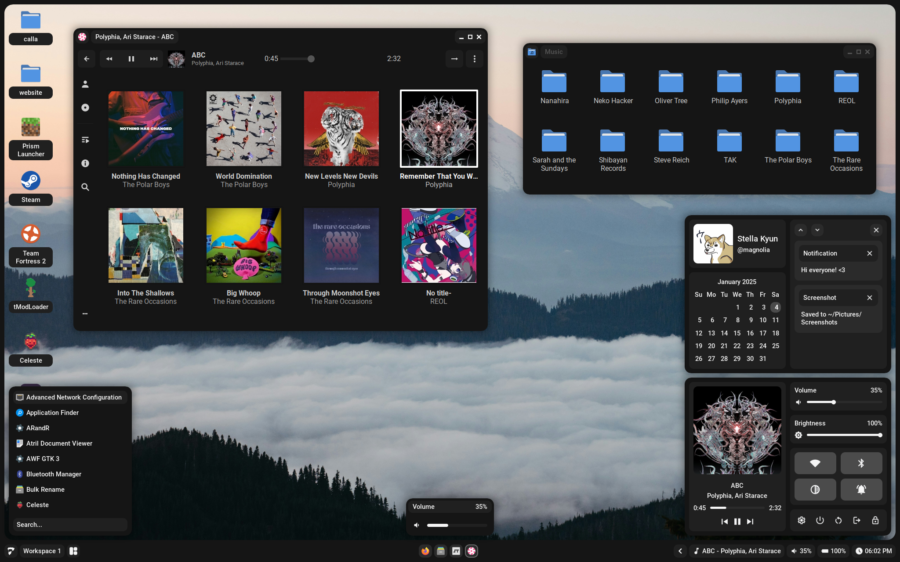
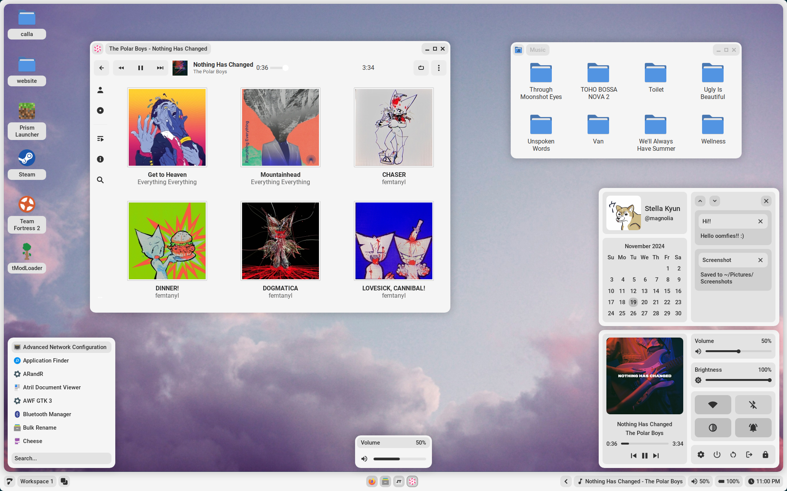
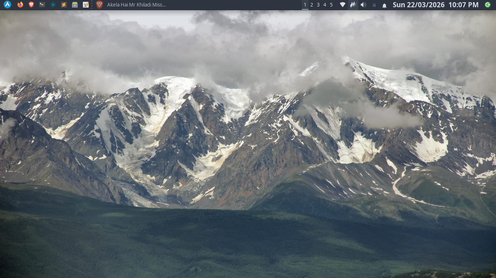
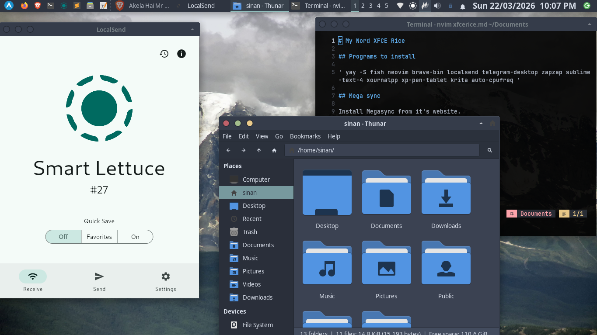

# ricefields
Personal Linux rice notes — AwesomeWM (Calla) + Nord XFCE setup, configs, and fixes.

# 🌾 My Linux Rice Collection

A personal guide documenting two desktop rices — **AwesomeWM (Calla)** and **Nord XFCE** — including installation steps, configuration tweaks, and everything needed to reproduce them from scratch.

---

## 🎨 AwesomeWM Rice — Calla Desktop

### Screenshots

| Dark Theme | Light Theme |
|---|---|
|  |  |

---

### Required Packages

```bash
yay -S awesome-git xorg pipewire pipewire-pulse wireplumber brightnessctl \
    inotify-tools picom maim papirus-icon-theme xsettingsd \
    network-manager-applet polkit-gnome playerctl lua-pam-git upower xclip --needed
```

### Optional Packages

```bash
yay -S lollypop gvim
```

### Theming

```bash
yay -S adw-gtk-theme chaotic-aur/bibata-cursor-theme --needed
```

---

### Building Calla for Arch Linux

Official Calla repository: <https://github.com/Stardust-kyun/calla>

```bash
git clone https://github.com/Stardust-kyun/calla.git
cd calla
makepkg -si
```

---

### Fixes & Tweaks

#### Bluetooth Error

```bash
sudo systemctl enable --now bluetooth
```

#### Picom Error

Open the compositor config:

```bash
sudo nano /usr/share/calla/compositor.conf
```

Add this line:

```
backend = "glx"
```

#### Control Panel Overlapping

Open the control panel init file:

```bash
sudo nano /usr/share/calla/desktop/theme/control/init.lua
```

Change this line:

```lua
-- Before
bottom = dpi(430)

-- After
bottom = dpi(360)
```

---

## 🔷 Nord XFCE Rice

### Screenshots

| Desktop | Apps |
|---|---|
|  |  |

---

### Required Packages

```bash
yay -S fish neovim brave-bin localsend telegram-desktop zapzap \
    sublime-text-4 xournalpp xp-pen-tablet krita auto-cpufreq bat eza
```

### Mega Sync

Install Megasync directly from its website:

> <https://mega.io/desktop>

### Chaotic AUR

Install Chaotic AUR from its website:

> <https://aur.chaotic.cx/>

---

### Fonts

```bash
yay -S ttf-jetbrains-mono-nerd ttf-fira-code
```

---

### NvChad Setup

#### Installation

```bash
git clone https://github.com/NvChad/starter ~/.config/nvim && nvim
```

#### Configuration

Edit `~/.config/nvim/lua/chadrc.lua` and add under the theme section:

```lua
transparency = true
```

Set the statusline theme:

```lua
M.ui = {
    statusline = { theme = "minimal" }
}
```

---

### Fish Shell

#### Remove Greeting

Add the following to `~/.config/fish/config.fish`:

```fish
set fish_greeting
```

#### Aliases

```fish
alias cat  "bat --theme=base16"
alias ls   'eza --icons=always --color=always -a'
alias ll   'eza --icons=always --color=always -la'

alias install  'sudo pacman -S'
alias search   'yay -Ss'
alias pacsearch 'sudo pacman -Ss'

alias update   'sudo pacman -Syu'
alias upgrade  'sudo pacman -Syyu'
alias yayup    'yay -Syu'
alias yayupg   'yay -Syyu'
```

---

### Theming

```bash
yay -S papirus-icon-theme papirus-nord nordic-theme-git \
    chaotic-aur/bibata-cursor-theme
```

---

### XFCE Tweaks

#### Panel Clock Format

```
%a %d/%m/%Y  %I:%M %p
```

#### Cursor Size

```bash
xfconf-query --channel xsettings --property /Gtk/CursorThemeSize --set 13
```


#### Sublime Text Customization

```bash
{
	"font_face": "JetBrainsMono Nerd Font",
	"font_size": 15,
	"save_on_focus_lost": true,
	"caret_style": "phase",
	"line_padding_bottom": 15,
	"line_padding_top": 15,

}
```

#### Sublime Text Plugin 
- Ayu Theme
- A File Icon
